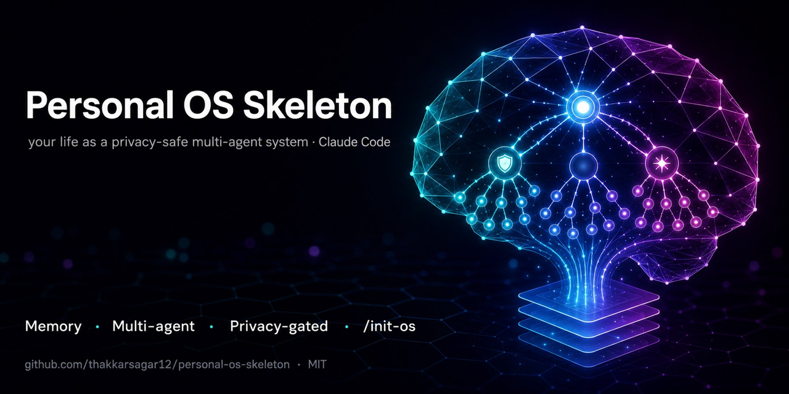

<p align="center">
  
</p>

<h1 align="center">Personal OS Skeleton</h1>

<p align="center">
  A privacy-safe, forkable <strong>Personal OS</strong> for Claude Code — your life as a multi-agent markdown system.
</p>

<p align="center">
  
  
  
  
</p>

---

## Why this exists

Most personal-knowledge systems leak data when you share or publish them. This skeleton ships with a **layered privacy defence** — a regex scanner (`scan-core.sh`), a fail-closed pre-push hook, and an opt-in CI workflow — that an independent review stress-tested against the maintainer's own data. The review caught gaps that self-checks missed: binary files skipped by naive scanners, a fail-open code path, and a name embedded in a commit template. All three are now gated. The result is a repo you can fork, fill, and push without worrying about what leaks.

---

## Feature overview

| Capability | What you get |
|------------|-------------|
| **Semantic memory** | Postgres + Qdrant semantic recall — conversations indexed, searchable by meaning |
| **Multi-agent orchestrator** | Master orchestrator → domain leads → specialists; mirrors how humans delegate |
| **Focus modes** | `/focus [domains/combo]` activates one or more domains at once (`decide`, `deep-work`, `full`, …) |
| **`make init` + `/init-os`** | One command to hook up git and one slash command to personalise domains, goals, and rules |
| **Privacy shipped** | Scanner + fail-closed pre-push hook + opt-in CI workflow — three independent gates |

---

## What is this?

A structured markdown workspace that turns Claude Code into your personal second brain and daily ops hub. It covers three domains out of the box (daily ops, second brain, study), wires them together with agents and slash commands, and includes tooling to keep your private fork private.

The skeleton gives you:

- Domain folders with `_index.md` files that agents read before touching full files
- A `system/` layer for cross-domain config (rules, behavior log, active context, pipelines)
- A library of skills invokable as `/slash-commands` inside Claude Code
- A `_templates/` directory with ready-made domain, agent, and skill scaffolds
- Privacy tooling: PII scanner, pre-push hook, shareable-fork wrapper

---

## Quickstart

```bash
# 1. Clone (or fork) and initialise
git clone <your-fork-url> my-personal-os
cd my-personal-os
make init          # runs setup.sh — installs git hook, checks deps

# 2. Open in Claude Code
code .             # or: claude .

# 3. Personalise
# Inside Claude Code, run:
/init-os           # guided setup — fills in your name, domains, goal
# Then start your first day:
/morning           # daily briefing
/capture [text]    # quick-capture anything
/evening           # end-of-day review
```

---

## Privacy stance

**This skeleton ships zero personal data.** Your fork is yours — keep it that way.

Before publishing or sharing your fork, run:

```bash
make scan          # PII scan + shareable-fork check
```

See [`PRIVACY.md`](PRIVACY.md) for the full discipline.

---

## Documentation

| Doc | What it covers |
|-----|----------------|
| [`docs/GETTING-STARTED.md`](docs/GETTING-STARTED.md) | First-run walkthrough, prerequisites, initial config |
| [`docs/ARCHITECTURE.md`](docs/ARCHITECTURE.md) | Domain layout, agent pipeline, system/ layer |
| [`docs/EXTENDING.md`](docs/EXTENDING.md) | Adding domains, agents, skills, slash commands |
| [`docs/RECOMMENDED-TOOLING.md`](docs/RECOMMENDED-TOOLING.md) | MCP integrations, optional infra (calendar, email, memory DB) |
| [`docs/CUSTOMIZING.md`](docs/CUSTOMIZING.md) | Adapting rules, routines, focus combos to your workflow |
| [`PRIVACY.md`](PRIVACY.md) | Allowlist philosophy, claude-mem hazard, `make scan` discipline |

---

## Key slash commands (once personalised)

| Command | Purpose |
|---------|---------|
| `/morning` | Daily briefing — tasks, calendar, habits |
| `/evening` | End-of-day review |
| `/capture [text]` | Quick-capture to `second-brain/inbox/` |
| `/task [...]` | Task management — add, list, done, next |
| `/focus [domain]` | Activate one or more domains |
| `/backlinks [entity]` | Show files referencing an entity |
| `/lint` | Knowledge-base audit — orphans, stale dates |
| `/weekly-review` | Weekly summary — wins, misses, patterns |

---

## Repository layout

```
.
├── CLAUDE.md                  # Claude Code instructions (customise this)
├── Makefile                   # init / doctor / scan / test / help
├── setup.sh                   # first-run setup
├── daily-ops/                 # tasks, habits, routines, reviews
├── second-brain/              # capture, notes, ideas, reading
├── study/                     # study tracks, roadmaps, notes
├── system/                    # cross-domain config and rules
├── _templates/                # scaffolds for new domains/agents/skills
├── docs/                      # full documentation
├── scripts/                   # privacy scanner, doctor, shareable-fork wrapper
└── tests/                     # hermetic test suite (run: make test)
```

---

## Requirements

- Claude Code CLI
- `bash`, `git`, `python3` (≥ 3.10 recommended)
- Optional: Docker (for memory DB), MCP servers (calendar, email, etc.)

See [`docs/RECOMMENDED-TOOLING.md`](docs/RECOMMENDED-TOOLING.md) for the full optional stack.

---

## License

MIT — see [`LICENSE`](LICENSE). Replace `{{YEAR}}` and `{{USER_NAME}}` before publishing your fork.
